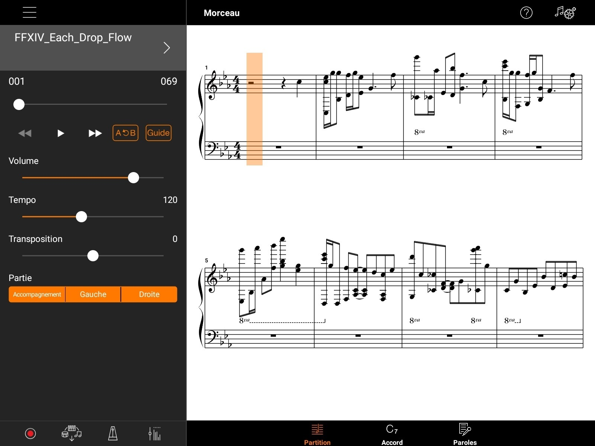
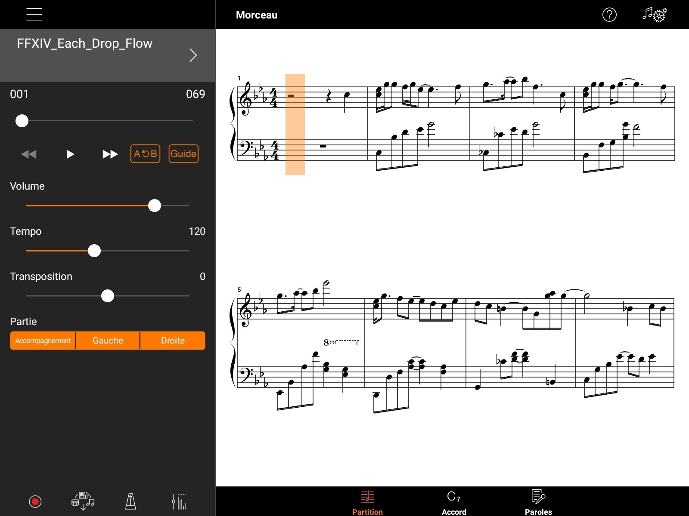

# Yamaha E-Seq Converter

Yamaha E-Seq Converter is a ES6 JavaScript tool that helps to convert a midi file into the [Yamaha's standard E-Seq format](https://usa.yamaha.com/support/faq/pianos/1636.html).

## Focus

Because most midi files only use one channel, the primary goal of this library is to correctly assign notes to the left and right hands. As a result, the features of software like [Smart Pianist](https://usa.yamaha.com/products/musical_instruments/pianos/apps/smart_pianist/index.html) can work properly.

|                   Before                    |                   After                   |
|:-------------------------------------------:|:-----------------------------------------:|
|  |  |

## Getting started

Provided midi files should not be in format `0` and should ideally have 2 tracks. If not, you will have to assign the tracks manually using the `Midi` class.

If a piano midi file has more than two tracks, the last two are usually the right and left hands.

### Installation

```
npm install @ablaise/yamaha-eseq-converter
```

### Events

Events are available and described on the table below.

|     Name      |                  Description                  |
|:-------------:|:---------------------------------------------:|
| `EVENT_READY` |    Triggered when the midi file is loaded.    |
|  `EVENT_ID`   | Triggered when a message event is being read. |

### Convert a piano midi file

Here is how you can use the library to convert your midi files. Change the code according to your needs.

```javascript
import Midi from "@ablaise/yamaha-eseq-converter/lib/Midi";
import Utils from "@ablaise/yamaha-eseq-converter/lib/Utils";

const midi = new Midi({
    autorun: true,
    path: './path/to/file.mid',
    //buffer: new ArrayBuffer(...) // or "buffer" option if you prefer to work with ArrayBuffer
});

/**
 * Here is how you can handle a two-tracks midi file for piano.
 */
window.addEventListener(Midi.EVENT_ID, (event) => {
    const data = event.data;
    if (Utils.isChannelAssignable(data.id)) {
        let track = 0
        switch (data.index) {
            case 0:
                track = Midi.TRACKS.PIANO_LEFT_HAND;
                break;
            case 1:
                track = Midi.TRACKS.PIANO_RIGHT_HAND;
                break;
            default:
                console.warn('Unhandled channel.')
                break;
        }

        // update the byte ID with the expected channel
        data.dv.setUint8(data.offset, Utils.setChannel(data.id, track));
    }
});

/**
 * Downloads the output midi file.
 */
window.addEventListener(Midi.EVENT_READY, (event) => {
    const data = event.data;
    const header = data.context.getHeader();
    if (0 === header.getType()) {
        throw 'Invalid midi type.';
    }

    midi.download();
});
```

You can also use a callback instead of the `EVENT_READY` event.

```javascript
import Midi from "@ablaise/yamaha-eseq-converter/lib/Midi";
import Utils from "@ablaise/yamaha-eseq-converter/lib/Utils";

const midi = new Midi({
    autorun: true,
    path: './path/to/file.mid',
    //buffer: new ArrayBuffer(...) // or "buffer" option if you prefer to work with ArrayBuffer
}, (data) => {
    const context = data.context;
    const header = context.getHeader();
    if (0 === header.getType()) {
        throw 'Invalid midi type.';
    }

    // ...
});
```

## Running tests

Yamaha E-Seq Converter uses the [Jest Javascript testing framework](https://jestjs.io). You can run them using the following command.

```
npm run test
```

## Final note

:construction: This tool is still experimental and was created to solve a specific problem. The midi file parser is not a hundred percent complete and may be incorrect in some cases, use it with caution.

### What's next?

- A demo website for batch conversion
- Improving the midi parser and fixes
- More events are coming soon
- More tests are coming soon

### Useful resources

Here are resources that helped me to understand the midi format.

- https://moddingwiki.shikadi.net/wiki/MID_Format
- http://midi.teragonaudio.com
- http://www.ccarh.org/courses/253/handout/smf/
- http://www.cs.uccs.edu/~cs525/midi/midi.html
